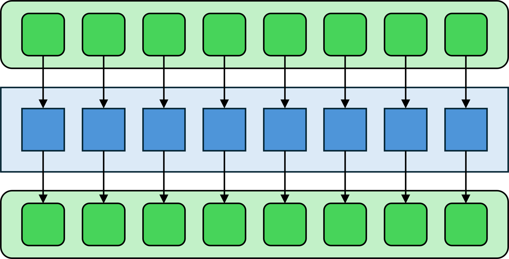
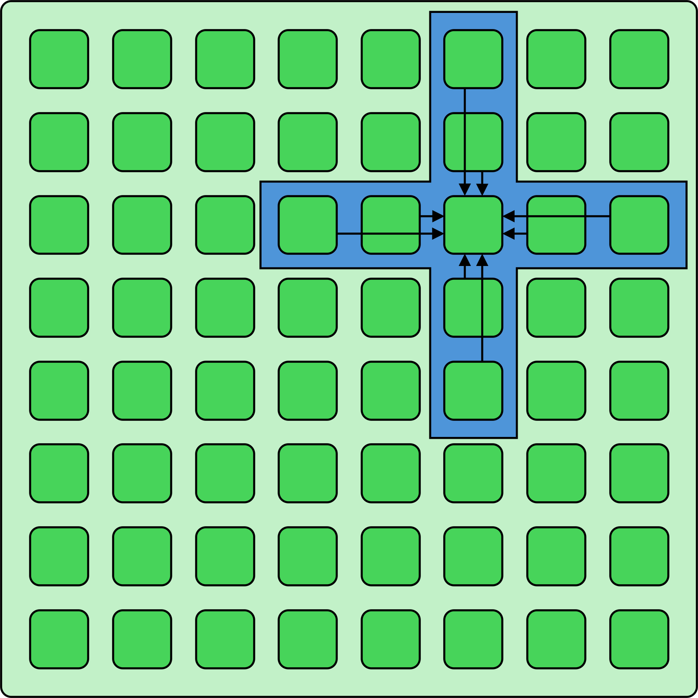
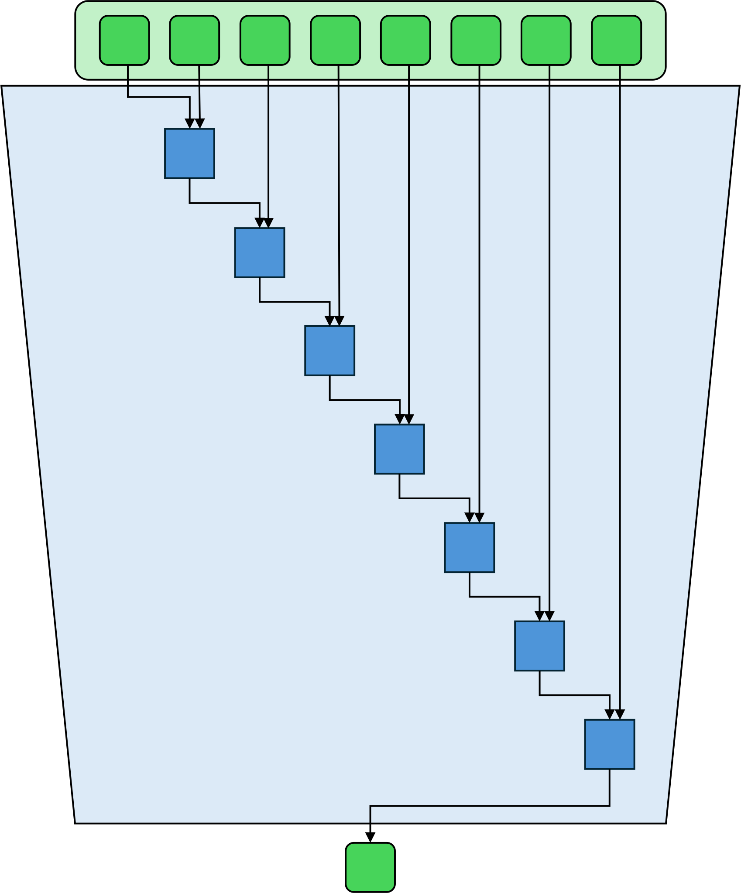
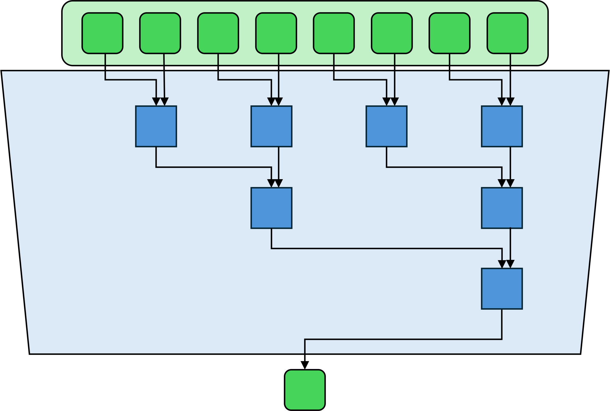
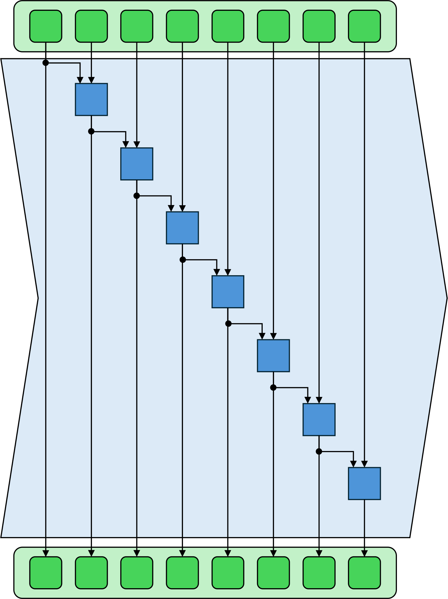
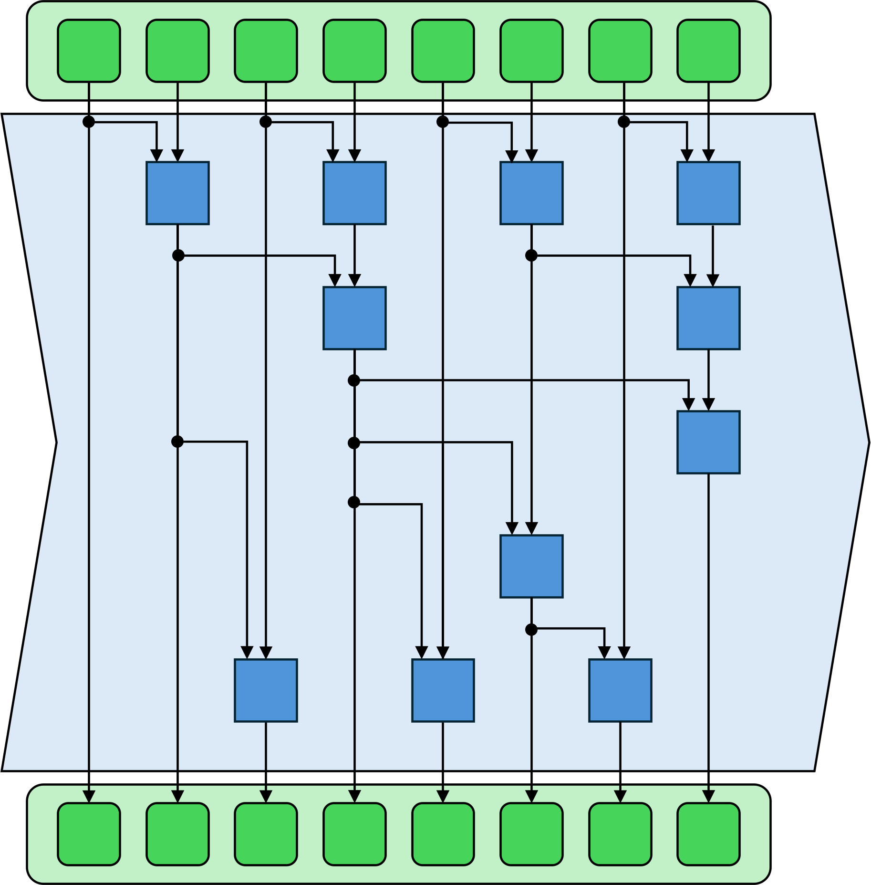

# Introduction to Basic and Advanced Parallel Computation Patterns

In this document, we'll explore four essential patterns commonly used in parallel computation: map, stencil, reduction, and scan. For clarity, we'll categorize these as "basic" and "advanced." Map and stencil are considered "basic" patterns, while reduction and scan fall under "advanced" patterns. The figures in this document are based on illustrations from lecture materials [3], a widely used resource in parallel computing education.

## Map
* Applies a pure, independent function to each element of a collection, producing an output collection of the same size and structure.
* Each operation is side-effect free and depends solely on its input, making loop iterations fully independent and highly amenable to parallelization.
* Commonly used in numerical computing, including linear algebra operations such as SAXPY.

<figure style="background-color: white; padding: 15px; display: inline-block;">
  
  <figcaption style="text-align: center; margin-top: 10px; font-size: 0.9em; color: \#555;">
    Fig. 1: the map pattern
  </figcaption>
</figure>

As Figure 1 illustrates, the map pattern is a cornerstone of parallel computing. It offers a simple and efficient way to transform large data collections. By ensuring that each output element depends only on its corresponding input element, the map pattern maximizes concurrency and simplifies implementation on modern parallel architectures. Its simplicity makes it well-suited for SIMD hardware and accelerators.

## Stencil
* Updates each element in a collection based on its own value and the values of its neighbors within a specified window.
* The shape and size of the neighborhood determine the nature of the computation, allowing for a variety of operations.
* Fundamental to convolution operations and widely used in scientific simulations and image processing.

<figure style="background-color: white; padding: 15px; display: inline-block;">
  
  <figcaption style="text-align: center; margin-top: 10px; font-size: 0.9em; color: \#555;">
    Fig. 2: the stencil pattern
  </figcaption>
</figure>

As Figure 2 demonstrates, the stencil pattern generalizes the map pattern by introducing dependencies between neighboring elements. This local context is essential for tasks like image blurring, edge detection, weather modeling, and computational fluid dynamics, where each output requires information from a neighborhood of inputs. Such patterns often benefit from specialized memory access techniques like texture memory and Shared Memory, and can involve Warp-level cooperation for optimized GPU performance.

## Reduction
* Aggregates all elements of a collection into a single value using an associative operation, such as sum, maximum, or logical AND.
* Associativity allows different execution orders and enables efficient parallelization.
* Partial results can be computed in parallel and then combined in a final aggregation step.

<figure style="background-color: white; padding: 15px; display: inline-block;">
  
  <figcaption style="text-align: center; margin-top: 10px; font-size: 0.9em; color: \#555;">
    Fig. 3: serial execution of the reduction pattern
  </figcaption>
</figure>
<figure style="background-color: white; padding: 15px; display: inline-block;">
  
  <figcaption style="text-align: center; margin-top: 10px; font-size: 0.9em; color: \#555;">
    Fig. 4: paralell execution of the reduction pattern
  </figcaption>
</figure>

Reduction is essential for summarizing large datasets and computing global statistics. As Figures 3 (serial execution) and 4 (parallel execution) illustrate, by leveraging associative operations, reductions can be organized in tree structures for scalable parallel execution, both on shared and distributed memory systems. This pattern often involves advanced library functions that handle data aggregation efficiently, optimizing for memory access patterns like striped loads to achieve high performance.

## Scan / Prefix Sum
* Computes, for each position in a collection, the cumulative result of applying an associative operation to all previous elements.
* Supports both inclusive and exclusive variants, depending on whether the current element is included in the cumulative result.
* Efficient parallel scan algorithms often use tree-based approaches to address inherent data dependencies.

<figure style="background-color: white; padding: 15px; display: inline-block;">
  
  <figcaption style="text-align: center; margin-top: 10px; font-size: 0.9em; color: \#555;">
    Fig. 5: serial execution of the scan pattern
  </figcaption>
</figure>
<figure style="background-color: white; padding: 15px; display: inline-block;">
  
  <figcaption style="text-align: center; margin-top: 10px; font-size: 0.9em; color: \#555;">
    Fig. 6: paralell execution of the scan pattern
  </figcaption>
</figure>

The scan pattern, also known as prefix sum, is essential to many parallel algorithms that require cumulative information, such as stream compaction, histogram generation, and parallel sorting. As Figures 5 (serial execution) and 6 (parallel execution) show, efficient implementations of scan are crucial for achieving high performance in these applications. This pattern often relies on specialized algorithms and libraries that can manage the inherent data dependencies, sometimes utilizing direct load patterns to ensure data integrity.

## References
If you're interested in learning more about parallel computation patterns, we recommend consulting the following resources:

1.  Rossbach, C. (2020). *Parallel Architectures, Parallel Algorithms, CUDA*. Department of Computer Science, The University of Texas at Austin. Lecture presented in CS378H.
2.  Kirk, D., & Hwu, W.-m. W. (2007-2012). *GPU Architecture and Parallel Programming: Lecture 11 Parallel Computation Patterns – Parallel Prefix Sum (Scan)*. University of Illinois. Lecture presented in CS/EE 217.
3.  Biswas, S. (2019-2020). *Parallel Patterns*. Department of Computer Science and Engineering, Indian Institute of Technology Kanpur. Lecture presented in CS 698L.
