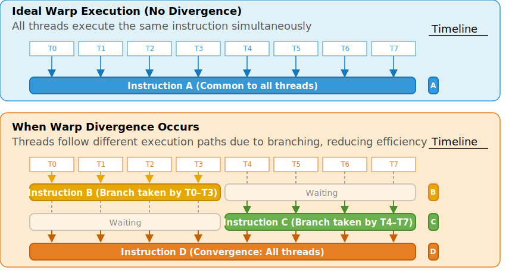
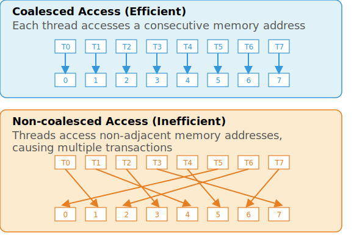

# Introduction to CUDA Programming and GPU Architecture
This document provides a foundational overview of NVIDIA GPU architecture and the CUDA programming model. Understanding these core concepts is essential for effectively developing high-performance parallel applications.

The figure in this document is reproduced from [1], an official NVIDIA technical document.

## Differences Between GPU and CPU Architectures
### Parallel Processing Model
NVIDIA GPUs are designed with a large number of simple cores, specialized for data-parallel processing. As depicted in Fig. 1, their architecture prioritizes a substantial allocation of computational resources (green), while intentionally limiting the space for cache (purple) and control (yellow) elements. They operate under the SIMT (Single Instruction, Multiple Threads) architecture, where threads are grouped into units called warps—typically 32 threads each. All threads in a warp start together at the same program address and execute one common instruction at a time. This allows the GPU to process thousands of threads simultaneously, maximizing throughput for data-parallel tasks. In contrast, CPUs have a small number of complex cores optimized for sequential execution and sophisticated control flow.
A modern NVIDIA GPU is organized into multiple Streaming Multiprocessors (SMs).
Each SM contains many lightweight processing units called CUDA Cores, which execute arithmetic and logic operations for individual threads.
The SM is responsible for scheduling and managing warps (groups of 32 threads) and provides access to on-chip resources such as shared memory and registers.
By grouping many CUDA Cores within each SM and deploying multiple SMs on a chip, NVIDIA GPUs can efficiently process thousands of threads in parallel.

<figure style="background-color: white; padding: 15px; display: inline-block;">
  
  <figcaption style="text-align: center; margin-top: 10px; font-size: 0.9em; color: #555;">
    Fig. 1: an example distribution of chip resources for a CPU versus a GPU [1]
  </figcaption>
</figure>

### Memory Latency
GPUs hide memory latency by maintaining many active warps per multiprocessor. When a warp is stalled waiting for data from memory, the scheduler can quickly switch to another ready warp, keeping the functional units busy and hiding latency. CPUs, however, mainly rely on large multi-level caches and speculative execution to reduce the impact of memory latency.

### Data Parallelism
GPUs are inherently suited for data-parallel workloads, applying the same operation to large datasets concurrently. This is achieved by launching thousands of threads, organized into blocks and warps, all performing similar computations. To utilize the hardware efficiently, developers must optimize memory access patterns so that threads in a warp access consecutive and well-aligned memory locations.

### Control Flow and Performance Impact of Divergence
While early GPUs had limited control flow capabilities, modern GPUs (such as those based on the Turing and Volta architectures) support more flexible branching and looping. However, when threads within a warp encounter a data-dependent branch and take different execution paths (a phenomenon called "warp divergence"), the warp must execute each path serially, disabling threads not taking the current path. This increases the total number of instructions executed and reduces overall throughput. For best performance, it is essential to minimize divergence within a warp—for example, by ensuring that conditional statements are structured so all threads in a warp follow the same path when possible.
As illustrated in Fig. 2, warp divergence occurs when threads within a warp follow different execution paths due to branching, resulting in serialized execution.

The SIMT architecture enables each thread to have its own program counter and register state, allowing independent branching on modern GPUs (Volta architecture and later). However, full efficiency is achieved when all threads in a warp execute the same instruction. The number of active warps per multiprocessor is also critical for hiding both arithmetic and memory latencies. If too few warps are resident (for example, due to high register or shared memory usage), the GPU may not be able to fully hide latency, reducing performance.

<figure style="background-color: white; padding: 15px; display: inline-block;">
  
  <figcaption style="text-align: center; margin-top: 10px; font-size: 0.9em; color: #555;">
    Fig. 2: example of warp execution and divergence in a SIMT architecture
  </figcaption>
</figure>

## CUDA Architecture
### Heterogeneous Computing
CUDA is based on a heterogeneous computing model, where the CPU (host) and GPU (device) work together to solve computational problems. The host is responsible for managing overall program flow and launching kernels, while the device executes highly parallel computations.

### CUDA C/C++
CUDA extends the C/C++ programming language with additional keywords and constructs that enable easy programming of GPUs. Developers can define functions, called kernels, that are executed in parallel by many threads on the GPU.

### Kernels
A kernel is a special function that runs on the GPU and is defined using the `__global__` keyword. When a kernel is launched, it is executed by a large number of threads in parallel. The number and organization of these threads are specified using the unique CUDA execution configuration syntax: `kernel<<<numBlocks, threadsPerBlock>>>`.

### Grid, Block, and Thread Hierarchy
When a kernel is launched, CUDA organizes its execution into a hierarchy of grids, blocks, and threads.
* Grid: The grid represents the entire set of threads that execute a kernel launch. It is composed of one or more thread blocks and can be one-, two-, or three-dimensional, allowing for flexible mapping to various data structures.
* Block: A block is a group of threads that execute together and can cooperate via fast, low-latency shared memory. Threads within a block can synchronize their execution using the `__syncthreads()` intrinsic. The size of a block can also be one-, two-, or three-dimensional, and each block is assigned a unique index within the grid.
* Thread: The thread is the smallest execution unit. Each thread has a unique identifier within its block (`threadIdx.{x, y, z}`) and is responsible for processing a specific portion of the data.

### Indexing and Memory Access
Each thread can determine which data to process by combining its thread index (`threadIdx.{x,y,z}`), block index (`blockIdx.{x,y,z}`), and block dimensions (`blockDim.{x,y,z}`). This allows each thread to compute a unique global index, which is commonly used to access elements in global memory efficiently, especially for large arrays or matrices.

### Thread Block Clusters (Compute Capability 9.0 and above)
Recent CUDA architectures introduce the concept of thread block clusters, which group multiple blocks together for enhanced cooperation and synchronization. Blocks in a cluster can communicate and synchronize using distributed shared memory and specialized APIs, further expanding the range of parallel algorithms that can be efficiently implemented on modern GPUs.

## CUDA Memory Hierarchy and Access Optimization
### Overview of the Memory Hierarchy
CUDA-enabled GPUs feature a complex memory hierarchy, including global memory, local memory, shared memory, registers, constant memory, and texture/surface memory. Each type has different size, speed, and usage characteristics.
In Fig. 3, the arrangement of CUDA Cores and Streaming Multiprocessors (SMs) is also illustrated.
This highlights how these processing units interact with the various levels of the GPU memory hierarchy to enable efficient parallel computation.

<figure style="background-color: white; padding: 15px; display: inline-block;">
  
  <figcaption style="text-align: center; margin-top: 10px; font-size: 0.9em; color: #555;">
    Fig. 3: memory hierarchy, CUDA cores and streaming multiprocessor
  </figcaption>
</figure>

### Global Memory
Global memory resides on the device and is the largest but slowest memory space. It is accessed via memory transactions of 32, 64, or 128 bytes, which must be naturally aligned. To maximize throughput, it is essential to use optimal access patterns, ensure data types are properly aligned and sized, and pad arrays, especially for two-dimensional arrays whose width should be a multiple of the warp size.

### Local Memory
Local memory is used for certain automatic variables such as large arrays, structures, or when register spilling occurs. Local memory resides in device memory, sharing the same high latency and low bandwidth as global memory, and thus benefits from the same coalescing techniques. For full coalescing, consecutive threads should access consecutive 32-bit words at the same relative address within their local memory. On devices with compute capability 5.x and above, local memory accesses are cached in L2.

### Shared Memory
Shared memory is on-chip and offers significantly higher bandwidth and lower latency than global or local memory. It is divided into banks, and simultaneous access to distinct banks by threads allows for parallel data access. However, if multiple threads access the same bank, bank conflicts occur, causing serializations and decreased throughput. Understanding the bank mapping and organizing data to minimize bank conflicts are crucial for optimal performance.

### Registers
Registers are private, on-chip memory for each thread, providing the fastest access. Efficient use of registers is important to maximize the number of active warps and overall performance.

### Constant Memory
Constant memory is located in device memory and cached in the constant cache. When multiple threads access different constant memory addresses, the request is split, reducing throughput. However, if all threads in a warp access the same address, the cache can serve the request efficiently.

### Texture and Surface Memory
Texture and surface memory are cached in the texture cache, which is optimized for 2D spatial locality. Fetching data through these memories is efficient when threads in a warp access spatially close addresses. Texture fetching can offer higher bandwidth than global memory if access patterns are irregular but exhibit locality. Additional benefits include offloading address calculation and optional data format conversion.

### Coalesced Access to Global Memory
Coalesced access to global memory is a crucial performance consideration in CUDA programming. For devices with compute capability 6.0 or higher, the device combines memory operations from threads in a warp into as few 32-byte transactions as possible, depending on access patterns. Fully coalesced accesses are achieved when threads access adjacent, properly aligned addresses; misaligned or strided accesses increase transaction count and reduce bandwidth. Developers should always strive for coalesced access patterns, such as having each thread in a warp access consecutive elements of a 32-byte aligned array.

As illustrated in Fig. 4, coalesced access occurs when threads in a warp access consecutive memory addresses, while non-coalesced access results from threads accessing non-adjacent locations, leading to inefficient memory transactions.

<figure style="background-color: white; padding: 15px; display: inline-block;">
  
  <figcaption style="text-align: center; margin-top: 10px; font-size: 0.9em; color: #555;">
    Fig. 4: example of coalesced and non-coalesced memory access in a SIMT architecture
  </figcaption>
</figure>

## References
1. NVIDIA Corporation. (2024). [*CUDA C++ Programming Guide*.](https://docs.nvidia.com/cuda/cuda-c-programming-guide/index.html)
2. NVIDIA Corporation. (2024). [*CUDA C++ Best Practices Guide*.](https://docs.nvidia.com/cuda/cuda-c-best-practices-guide/index.html)
