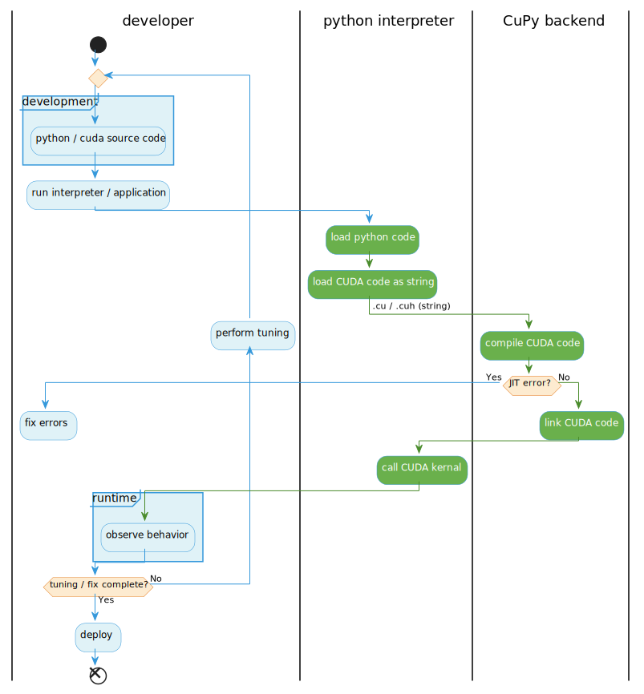
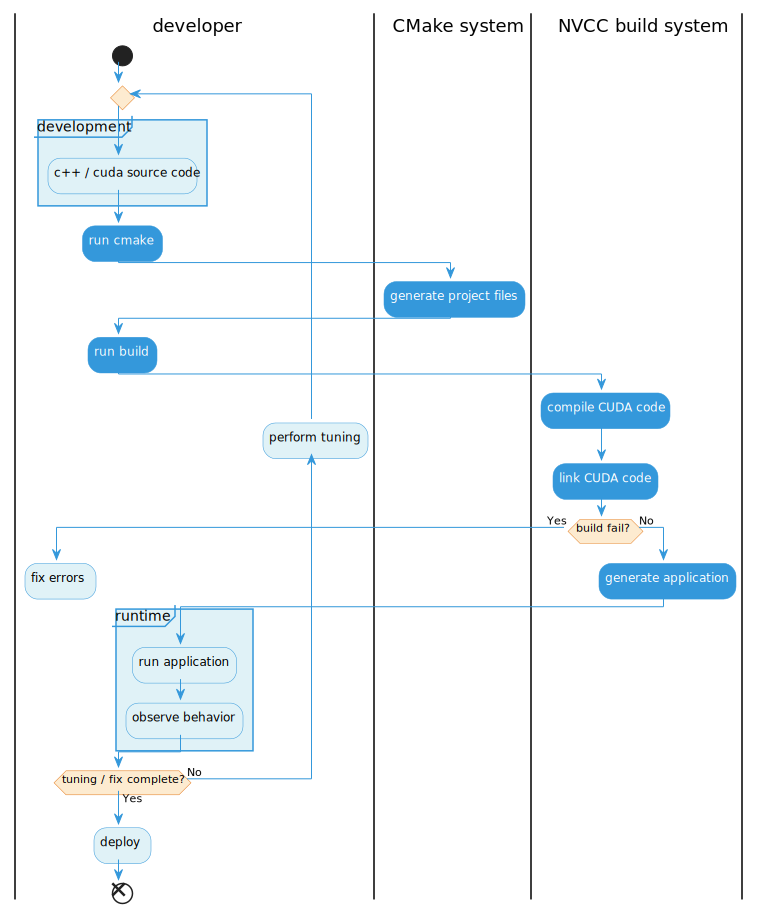

# Why and When to Use JIT vs. AOT
This document compares Just-In-Time (JIT) CUDA development with CuPy to Ahead-Of-Time (AOT) development using CUDA/C++ and CMake. Understanding these different approaches will help readers appreciate CuPy's strengths and decide when each method is most appropriate for their GPU programming tasks.

## Understanding the Development Workflow: JIT vs. AOT
The fundamental difference between JIT and AOT compilation lies in when and how CUDA code gets compiled.

### Just-In-Time (JIT) Compilation with CuPy
When developing CUDA kernels with CuPy's `RawModule` using the default NVRTC backend, the CUDA source code is compiled on-the-fly at Python runtime.
This process often feels seamless: one writes CUDA code as a Python string, and when executing the Python script, CuPy handles the compilation and execution of the kernel.

**Key Advantages**:

  * Rapid Iteration and Prototyping: The absence of explicit compile and link steps means one can quickly modify CUDA kernels and immediately test them by simply re-running the Python script. This accelerated development cycle is ideal for experimenting with new algorithms, rapid prototyping, and fine-tuning performance.
  * Easier Debugging: CuPy's integration with the Python ecosystem often simplifies debugging. Errors within the CUDA kernels are typically caught and reported within the Python environment, making them relatively easier to pinpoint and resolve.
  * Seamless Python Ecosystem Integration: CuPy provides a NumPy-compatible API, allowing for seamless integration with existing Python data science libraries (like Pandas, Scikit-learn) and deep learning frameworks (PyTorch, TensorFlow). This makes it incredibly powerful for incorporating GPU computations into Python-centric workflows.

<figure style="background-color: white; padding: 15px; display: inline-block;">
  
  <figcaption style="text-align: center; margin-top: 10px; font-size: 0.9em; color: #555;">
    Fig. 1: JIT compilation process of CuPy. Notice the tight feedback loop that enables rapid iteration.
  </figcaption>
</figure>

Fig. 1 illustrates the JIT compilation process of CuPy, emphasizing the tight feedback loop that enables rapid iteration and development.

### Ahead-Of-Time (AOT) Compilation with CUDA/C++ and CMake
AOT compilation involves explicitly compiling CUDA source code into a binary executable or library before runtime. For CUDA/C++ projects, this typically involves using CMake to manage the build process and NVCC (NVIDIA CUDA Compiler) for compilation and linking.

**Key Characteristics and Advantages:**

  * Explicit Build Steps: Developing with CUDA/C++ and CMake requires defining the project structure in `CMakeLists.txt` and performing explicit compile and link operations. Every code modification necessitates a re-build, which can introduce overhead into the development cycle.
  * Deep Optimization and Low-Level Control: AOT compilation enables developers to exercise fine-grained control over the compilation process and target hardware. This is crucial for final product optimization, building high-performance libraries, and achieving extreme performance where every ounce of efficiency matters. Developers can leverage specific compiler flags and integrate directly with low-level CUDA APIs.
  * Advanced Profiling and Debugging: While the build cycle may be longer, AOT development provides unparalleled access to specialized profiling and debugging tools from NVIDIA. These tools offer deep insights into GPU hardware behavior that are essential for advanced optimization.

<figure style="background-color: white; padding: 15px; display: inline-block;">
  
  <figcaption style="text-align: center; margin-top: 10px; font-size: 0.9em; color: #555;">
    Fig. 2: AOT compilation process of CUDA/C++. This process involves explicit build steps, leading to a longer iteration cycle.
  </figcaption>
</figure>

Fig. 2 depicts the AOT compilation process for CUDA/C++, highlighting the explicit build steps that lead to a longer development iteration cycle.

## Advanced Profiling Tools for AOT Development
For CUDA/C++ AOT development, NVIDIA offers powerful tools crucial for achieving peak performance and intricate debugging:

### NVIDIA Nsight Systems
NVIDIA Nsight Systems is a system-wide performance analysis tool designed to visualize an application's algorithms and identify optimization opportunities across both CPUs and GPUs. It provides a unified timeline that correlates activities from the CPU, GPU (including CUDA API calls and low-level hardware metrics such as PCIe throughput and Streaming Multiprocessor (SM) utilization), and Operating System (OS) interactions. This facilitates the identification of system-level bottlenecks, synchronization issues, and inter-thread dependencies, offering a holistic view of application behavior. It is particularly valuable for understanding why a GPU might be idle or if the CPU is the limiting factor in overall performance.

### NVIDIA Nsight Compute
NVIDIA Nsight Compute is an interactive kernel profiler specifically designed for CUDA and NVIDIA OptiX applications. It delivers detailed performance metrics and API debugging capabilities, enabling a deep dive into the execution of individual CUDA kernels. Nsight Compute collects comprehensive GPU hardware metrics and directly correlates them with the kernel's source code. This capability facilitates the pinpointing of inefficiencies related to memory access patterns, warp stalls, and instruction throughput within the kernel. Its guided analysis, memory workload visualization, and source-to-metric correlation features empower users to identify performance issues and receive actionable optimization advice, even without extensive GPU architecture expertise.

## CuPy's Flexibility: Switching `RawModule` Backends
While CuPy's `RawModule` defaults to the NVRTC backend for rapid JIT compilation (`backend='nvrtc'`), it also offers the flexibility to use NVCC (NVIDIA CUDA Compiler) as its backend (`backend='nvcc'`).

  * NVRTC (default): Ideal for rapid iteration and a fast development cycle, compiling CUDA code in memory during Python execution.
  * NVCC (optional): Provides broader support for advanced CUDA features and C++ standards, often employed for more complex kernels or when integrating with specific CUDA libraries (e.g., CUB, as will be seen later in this material). This option enables CuPy to leverage the full capabilities of the installed NVIDIA CUDA Toolkit's compiler.

This ability to switch backends highlights CuPy's adaptability, allowing one to choose the appropriate compilation strategy based on project needs, balancing between quick prototyping and access to more advanced CUDA compilation features.
In particular, the NVCC backend will be found essential when working with libraries like CUB later in this series, as CUB often requires the broader C++ feature support provided by NVCC.

## References
1. NVIDIA Corporation. (2024). [*NVIDIA Nsight Systems*.](https://developer.nvidia.com/nsight-systems/)
1. NVIDIA Corporation. (2024). [*NVIDIA Nsight Compute*.](https://developer.nvidia.com/nsight-compute/)
2. Preferred Networks, Inc. and Preferred Infrastructure, Inc. (2024). [*CuPy – NumPy & SciPy for GPU*.](https://docs.cupy.dev/en/latest/index.html)
